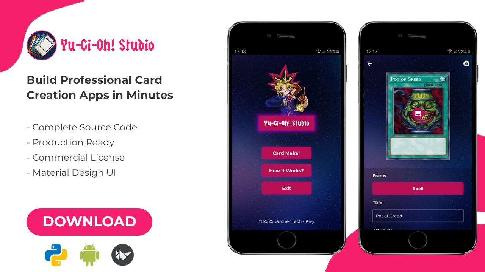
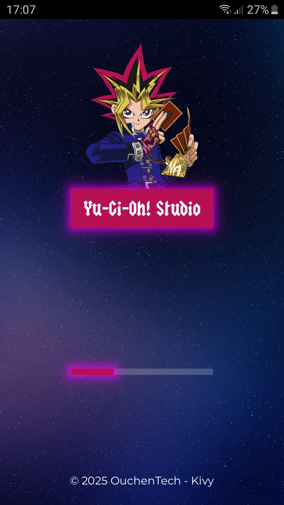
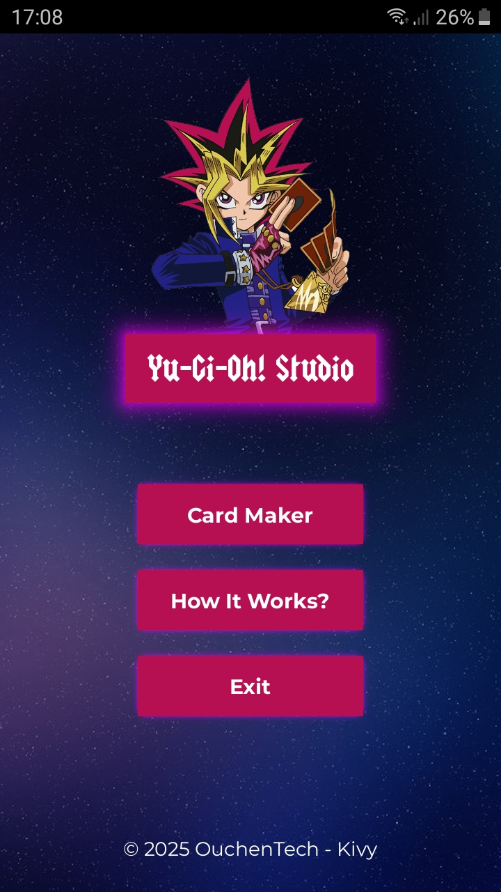
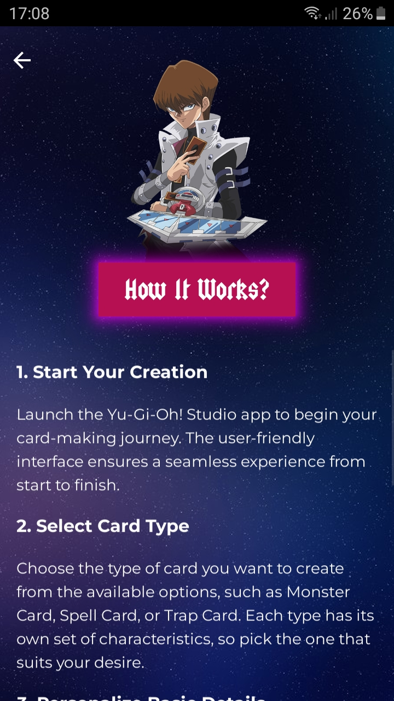
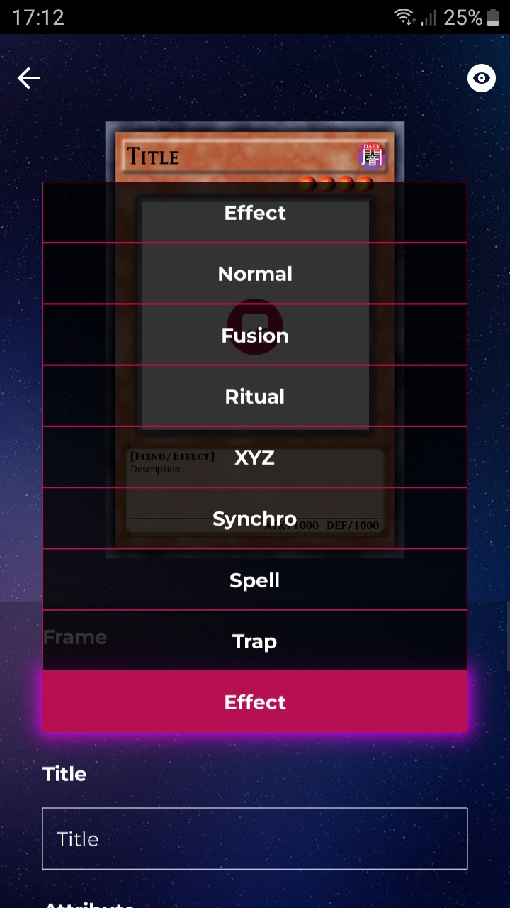
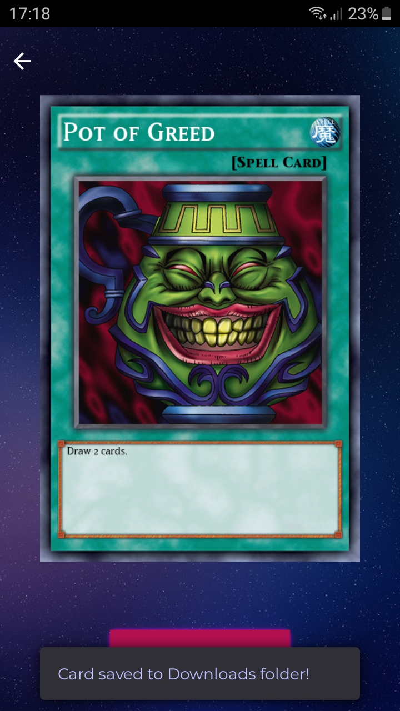

# Yu-Gi-Oh! Studio - Complete App Template

[]

---

## 🎯 What You're Getting

**Yu-Gi-Oh! Studio** is a complete, production-ready mobile app template that lets users create custom Yu-Gi-Oh! cards with professional quality. 

### ✨ Key Highlights

- **Complete Source Code** - Every line documented and explained
- **Professional UI/UX** - Modern Material Design interface
- **Automated Build Pipeline** - GitHub Actions for effortless APK generation
- **Commercial License** - Sell your customized versions freely

---

## 🎮 App Features Overview

### Card Creation Capabilities
- **8 Complete Card Types**: Normal, Effect, Ritual, Fusion, Synchro and XYZ Spell and Trap 
- **Real-Time Preview**: See changes instantly as you design
- **Custom Artwork Upload**: Support for PNG/JPG images
- **Full Text Customization**: Names, Monster types, Spell/Trap types, effects, ATK/DEF values
- **Good-Quality Export**: Generate cards as crisp PNG files ready for printing or sharing

### Technical Excellence
- **Optimized Performance**: Smooth rendering even on older devices
- **Error Handling**: Robust crash prevention and user feedback
- **Memory Management**: Efficient image processing for mobile devices

---

## 🛠️ Technical Stack
- **Python 3.7+** - Main programming language
- **Kivy/KivyMD** - Modern UI framework with Material Design
- **Pillow (PIL)** - Professional image processing library
- **androidstorage4kivy** - A package for accessing Android Shared Storage

---

## 📁 Complete File Structure

```
Yu-Gi-Oh-Studio-Template/
├── 📱 app/                           # Main application code
│   ├── screens/                      # All app screens
│   │   ├── starterscreen/            # Initial loading screen
│   │   │   ├── starterscreen.py
│   │   │   └── starterscreen.kv
│   │   ├── menuscreen/               # App menu screen
│   │   │   ├── menuscreen.py
│   │   │   └── menuscreen.kv
│   │   ├── cardmakerscreen/          # Main card creation interface
│   │   │   ├── cardmakerscreen.py
│   │   │   └── cardmakerscreen.kv
│   │   ├── downloadscreen/           # Viewing and saving created cards
│   │   │   ├── downloadscreen.py
│   │   │   └── downloadscreen.kv
│   │   └── instructionscreen/        # Application instructions and usage rules
│   │       ├── instructionscreen.py
│   │       └── instructionscreen.kv
│   ├── customwidgets/                # Reusable UI components
│   │   ├── custombuttons/            # Styled buttons
│   │   │   ├── custombuttons.py
│   │   │   └── custombuttons.kv
│   │   ├── customsnackbars/          # Styled snackbar notifications
│   │   │   ├── customsnackbars.py
│   │   │   └── customsnackbars.kv
│   │   ├── customlabels.kv           # Custom labels styling
│   │   ├── customspinners.kv         # Custom dropdown spinners
│   │   └── customtextinputs.kv       # Custom text input fields
├── 🎨 assets/                        # All visual resources
│   ├── card_elements/                # Card graphics and frames
│   ├── fonts/                        # Typography files
│   └── ui/                           # Interface graphics
├── ⚙️ utils/                         # Core functionality modules
│   ├── Artwork.py                    # Handles loading and resizing card artwork images
│   ├── Attribute.py                  # Handles loading and resizing card attribute images
│   ├── CardText.py                   # Handles text rendering properties and positioning
│   ├── configs.py                    # Contains all static configuration data
│   ├── Frame.py                      # Handles loading and resizing card frame images
│   ├── Level.py                      # Handles loading and resizing card level star images
│   └── Symbol.py                     # Handles loading and resizing card symbol images
├── 🚀 .github/workflows/             # Automation pipeline
│   └── build.yml                     # Auto-APK generation workflow
├── main.py                           # Application entry point
├── main.kv                           # Main KV file - handles loading widgets and screen manager
├── icon.png                          # App icon file
├── presplash.png                     # App splash screen image
├── buildozer.spec                    # Android build configuration
├── requirements.txt                  # Python dependencies list
├── LICENSE                           # MIT License
└── README.md                         # Quick start guide
```

---

## Application Screens

### Starter Screen

[]

### Menu Screen

[]

### Instruction Screen

[]

### Card Maker Screen

[]

### Download Screen

[]

---

## 🎯 Perfect For

### 👨‍💻 Developers & Entrepreneurs
- **App Developers** looking for a proven mobile app foundation
- **Freelancers** wanting to offer custom card creation services
- **Startups** building gaming or creative tools
- **Students** learning mobile development with a real project

### 🎮 Content Creators & Communities
- **Yu-Gi-Oh! Content Creators** offering custom card services
- **Gaming Communities** creating custom content
- **Educational Projects** teaching game design concepts
- **Personal Projects** for card game enthusiasts

---

## 🚀 Quick Start Guide

### Step 1: Download & Setup
```bash
# After purchasing from Ko-fi, extract the template files
# Navigate to the template directory
cd Yu-Gi-Oh-Studio-Template

# Install dependencies
pip install -r requirements.txt
```

### Step 2: Test Run
```bash
# Run on desktop
python main.py

# Your app is now running!
```

### Step 3: Build APK
```bash
# Install buildozer
pip install buildozer

# Generate Android APK
buildozer android debug
```
---

## 🎨 Customization Made Easy

### Basic Branding
1. **App Identity**
   - Change app name in `buildozer.spec` file
   - Replace logo in `icon.png`
   - Update splash screen in `presplash.png`

2. **Color Scheme**
   - Edit theme colors in KV files within each screen folder
   - Modify button colors in `app/customwidgets/custombuttons/`
   - Update UI element colors in respective KV files

### Card Design Customization

#### Adding New Card Frames
```python
# In utils/configs.py
CARD_CONFIGS = {
    'YourCustomType': {
        'frame_path': 'assets/card_elements/frames/custom_frame.png',
        'is_monster': True,
        # Add your custom configuration here
    }
}

# Update frames list in `cardmakerscreen.kv`
```

#### Custom Fonts
- Replace TTF files in `assets/fonts/`
- update `utils/configs.py`
- update `_init_card_components()` in `cardmakerscreen.py`

#### Frame Modifications
- Replace PNG files in `assets/card_elements/frames/`
- **Important**: Current cards are generated at 421x614 pixels

### Card Quality Enhancement Options

#### Implementing Multiple Quality Levels
The template generates cards at 421x614 pixels (standard quality). For premium features, you can implement multiple quality options:

**Option 1: Higher Quality Cards (Premium Feature)**
1. **Source Higher Resolution Frames**
   - Find 800x1200+ card frames from Yu-Gi-Oh! resources websites
   - Replace existing frames in `assets/card_elements/frames/`

2. **Update Utils Classes**
   ```python
   # In utils/Frame.py - adjust dimensions
   
   # Update sizing and positioning in update `utils/CardText.py`, `utils/Attribute.py`, etc.
   # All element sizes and positions need to be scaled proportionally
   ```

3. **Monetization Strategy**
   - Standard quality: Free
   - High quality: Premium feature or ad-gated

**Quality Comparison**:
- **Standard (421x614)**: Good for mobile viewing and social sharing
- **High (800x1200)**: Perfect for printing and professional use

### Advertisement Integration

The template doesn't include ads by default, but you can easily add monetization:

#### Option 1: KivMob Integration
```python
# Install KivMob
pip install kivmob

# Example of usage:

# In downloadscreen.py, add:
from kivmob import KivMob, TestIds

class DownloadScreen(Screen):
    def __init_(self, *kwargs):
        super(DownloadScreen, self).__init__(*kwargs)
        self.ads = KivMob(TestIds.APP)
        self.ads.new_banner(TestIds.BANNER)
        # Your existing code
```

#### Option 2: Custom Ad Module
Create your own ad integration:
- **Banner Ads**: At the bottom in downloadscreen
- **Interstitial Ads**: After card generation
- **Rewarded Ads**: For premium features (high-quality export)

#### Ad Placement Strategies
- **Card Export**: Show ad before high-quality download
- **Premium Features**: Rewarded video for special frames/effects

### Advanced Modifications
- **Card Collections**: Organize cards into custom decks
- **Export Formats**: Add PDF, SVG support for printing

---

## 📱 Deployment Options

### Option 1: Automated GitHub Build (Recommended)
1. Upload your customized template to a GitHub repository
2. GitHub Actions automatically builds APK on every push
3. Download APK from Actions > Artifacts
4. **Zero manual configuration required!**

### Option 2: Local Build
```bash
# Debug build (for testing)
buildozer android debug

# Release build (for distribution)
buildozer android release
```

## 🤝 Support & Community

### What's Included
- **Bug Fixes** - Free updates for any issues discovered
- **Customization Guidance** - Help with template modifications
- **Build Support** - Assistance with APK generation issues

### Premium Support Options
- **Custom Development** - Tailored modifications
- **Ad Integration Service** - Complete monetization setup

---

## ⚖️ License & Usage Rights

### What You CAN Do
✅ **Commercial Use** - Sell your customized apps freely  
✅ **Modifications** - Change any part of the code  
✅ **Redistribution** - Share your modified versions  
✅ **Private Use** - Use for personal projects  
✅ **Monetization** - Add ads, premium features, subscriptions  

### What You CANNOT Do
❌ **Resell Template** - Cannot sell the unmodified template  
❌ **Remove Attribution** - Must credit original template in app's about section  
❌ **Warranty Claims** - Provided as-is without warranty  

---

## 💬 Frequently Asked Questions

**Q: What card resolution does the template generate?**  
A: Cards are generated at 421x614 pixels (standard quality). You can upgrade to higher resolutions by replacing frame assets and adjusting utils classes.

**Q: Can I add advertisements to monetize the app?**  
A: Yes! While ads aren't included, you can easily integrate KivMob or create custom ad modules. Popular strategies include rewarded ads for premium features.

**Q: Do I need experience with Kivy/KV files?**  
A: Basic understanding helps, but the modular structure makes it beginner-friendly. Each screen has separate .py (logic) and .kv (design) files.

**Q: How do I change card frame designs?**  
A: Replace PNG files in `assets/card_elements/frames/`. For different sizes, you'll need to adjust positioning in the utils classes.

**Q: Can I create different card games with this template?**  
A: Absolutely! The modular design makes it easy to adapt for any card game by modifying utils files code and replacing assets.

**Q: What about Google Play Store approval?**  
A: The template follows Play Store guidelines. Ensure your customized version complies with their policies, especially regarding intellectual property.

**Q: Is the template suitable for commercial apps?**  
A: Yes! It's production-ready with proper error handling, performance optimization, and professional UI/UX design.

---

## 🎉 Ready to Start Building?

### What You Get Instantly
- ✅ Complete source code with KV files
- ✅ All card frames and UI assets
- ✅ Automated build pipeline setup  
- ✅ Commercial license with full rights

---

**Transform your idea into a profitable card creation app today!**

---

*© 2025 OuchenTech*
